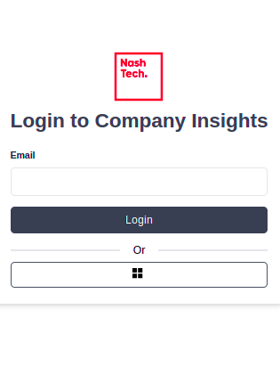
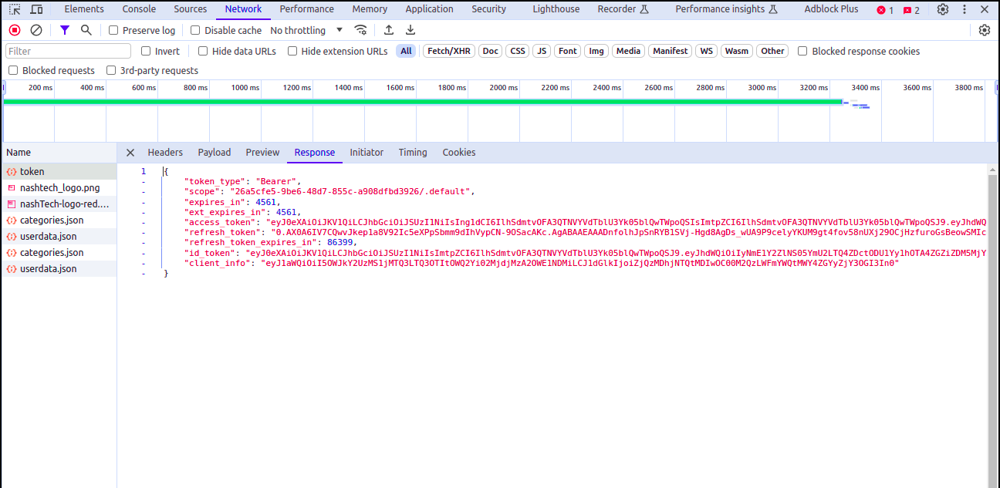

# Contribution Service
The Contribute Service receives user input regarding competency contributions. It stores this information in both MongoDB and the Snowflake RAW table. This service handles the interaction where users provide input related to competency contributions, and it ensures that the data is stored in the appropriate databases.

### Swagger UI for Test Rest-Endpoint
Test with Swagger: Run contribution-service, and access the swagger UI at http://localhost:8081/swagger-ui.html. You’ll see the endpoints, where you can test file uploads.

### Swagger UI for Rest-Endpoint

1) Ensure you have the environment variable set up, which should point to the location of the key.json file.

2) Run the compentency-insights-ui service. You can do this by executing npm install followed by npm start. Once started, navigate to the service page.
    

3) After reaching the service page, right-click and select "Inspect" to open the browser's developer tools.

4) Proceed to sign in on the service page. Once signed in, navigate to the "Network" tab within the developer tools.
    

5) As you see in above image Within the "Network" tab, locate the request for which you'll find the access token. Typically, this request will have the word "token" in its name.

6) Once you've identified the relevant request, click on it. Within the "Response" section of the request details, you will find the access token.

7) Copy the access token from the "Response" section.

8) Now, open the Swagger UI at http://localhost:8081/swagger-ui.html.

9) Locate the "Authorize" button/icon within the Swagger UI interface and click on it.

10) A dialogue box will appear asking for authorization. Paste the access token you copied earlier into the provided field.

11) After adding the access token, click on "Authorize" to authenticate.

With these steps, you should now be able to test the endpoints using Swagger UI with the appropriate access token.